# ДЗ№2 (Linux работа с памятью и процессами)

## Задание 1. Systemd

* Создал bash скрипт [homework_service.sh](./homework_service.sh) и соответствующий ему [homework_service.service](./homework_service.service). Созданный systemd unit запустил.
  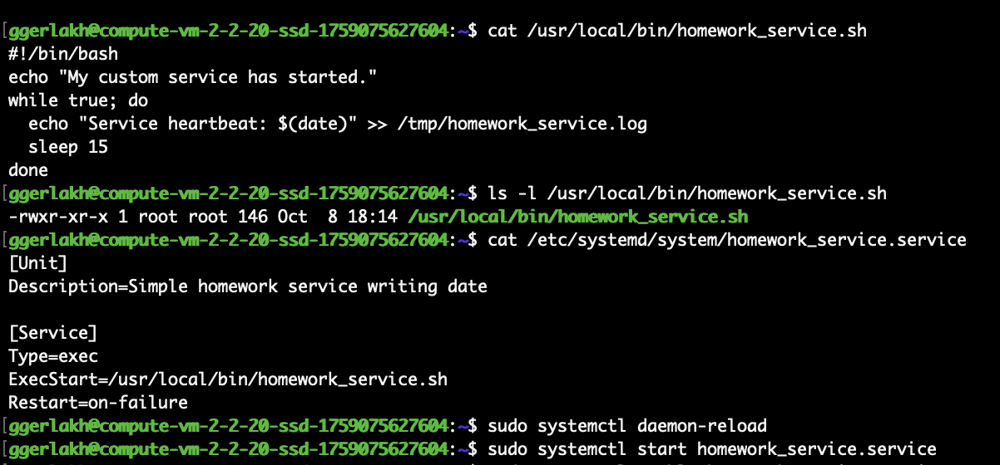
* Проверил status созданного systemd unit через команду  
  ```bash
  sudo systemctl status homework_service.service
  ```

  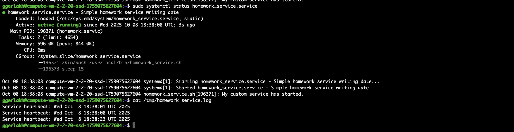
* Пробую перезапустить сервис и затем "убить" его, послав SIGKILL  
  ```bash
  sudo kill -9 196908
  ```

  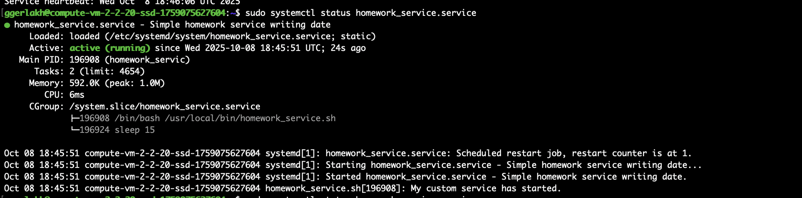
  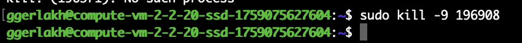
* Судя по логам, сервис перезапустился 
  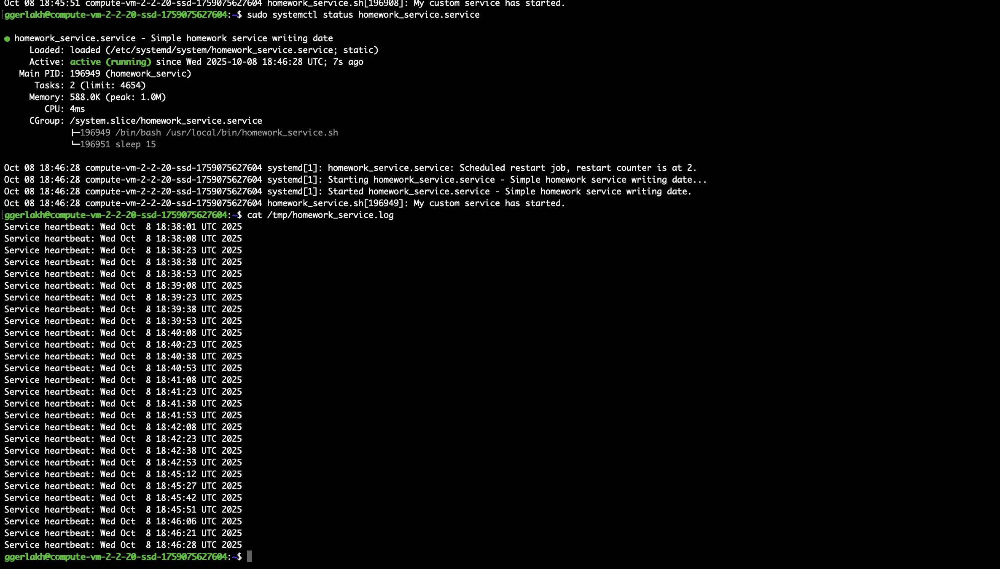
* Используя systemd-analyze, вывел топ-5 unit’ов стартующих дольше всего  
  ```bash
  systemd-analyze blame | head -n 5
  ```

  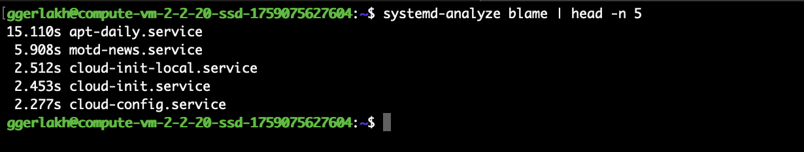


## Задание 2. Межпроцессное взаимодействие (IPC) с разделяемой памятью

* Создал файл с программой на C [shm_creator.c](./shm_creator.c), создающей  шареную память, и запустил ее  
  ```bash
  gcc shm_creator.c -o shm_creator
  touch homework_key
  ./shm_creator
  ```

  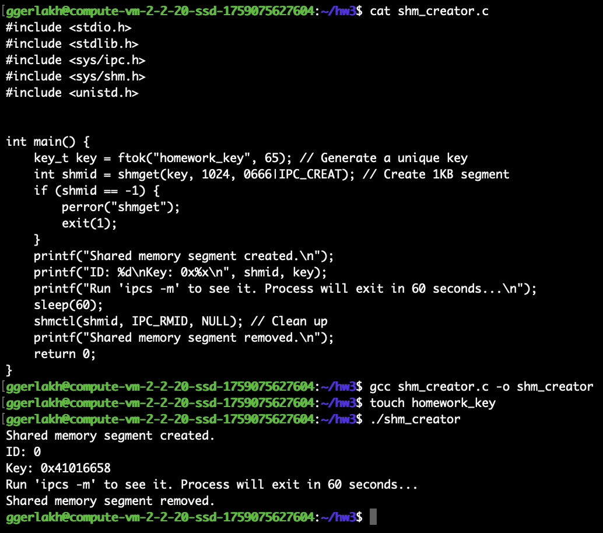  
* В соседнем терминале запустил `ipcs -m`, в котором показаны данные о созданом сегменте shared_memory, идентификатор сегмента, key — ключ созданного сегмента, права доступа, размер и количество присоединенных к сегменту процессов  
  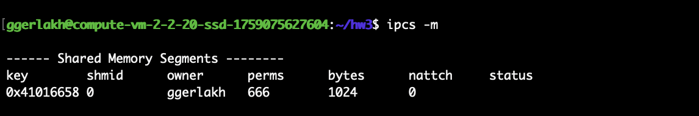  

## Задание 3. Анализ памяти процессов (VSZ vs RSS) 

* Запустил программу на Python в первом терминале, которая запрашивает 250 MiB памяти и держит ее 2 минуты  
  ```bash
  python3 -c "print('Allocating memory...'); a = 'X' * (250 * 1024 * 1024); import time; print('Memory allocated. Sleeping...'); time.sleep(120);"
  ```

  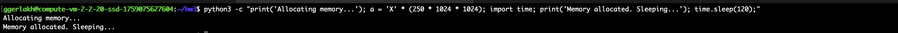
* Во втором терминале нашел pid созданного процесса и вывел данные по используемой памяти RSS и VSZ  
  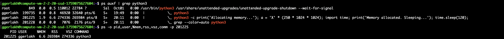
* Память RSS не 0, так как в программе была выделена память под строку, но в ней также еще и учитывается исходная память процесса-интерпретатора python.  
  Память VSZ > RSS, так как еще есть overhead python, связанный с подключаемыми библиотеками и резервом выделяемым под Python heap

## Задание 4. NUMA и cgroups (35 баллов)

* При помощи команды `numactl --hardware`, я вывел количество нод на сервере и количество памяти для каждой NUMA ноды.  
  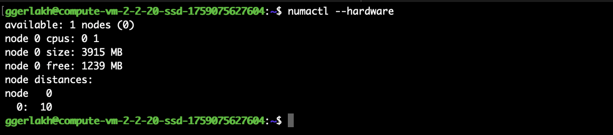
* Запустил команду systemd-run.  
  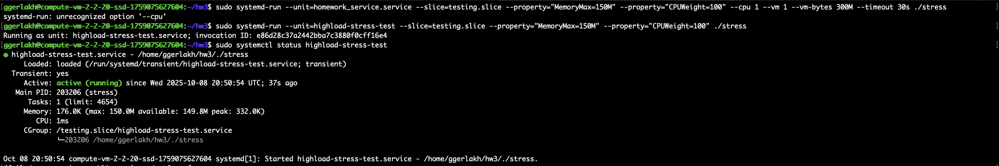
* **Будет ли работать тест если мы запрашиваем 300М оперативной памяти, а ограничивыем 150М?**  
  Не будет, так как из-за ограничений MemoryMax при превышении лимита, процесс будет убит OOM killer
* Запустил команду `echo q | systemd-cgtop -p testing.slice` для мониторинга используемых ресуров
  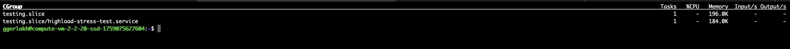
* **Опишите что делает и для ччего можно использовать MemoryMax and CPUWeight.**  
  MemoryMax позволяет задать «жесткий» лимит по памяти для процесса, используя механизм cgroups. При превышении этого лимита, процесс будет убит OOM killer.
CPUWeight можно использовать для пропорциональным распределением времени CPU между конкурирующими systemd сервисами. 
