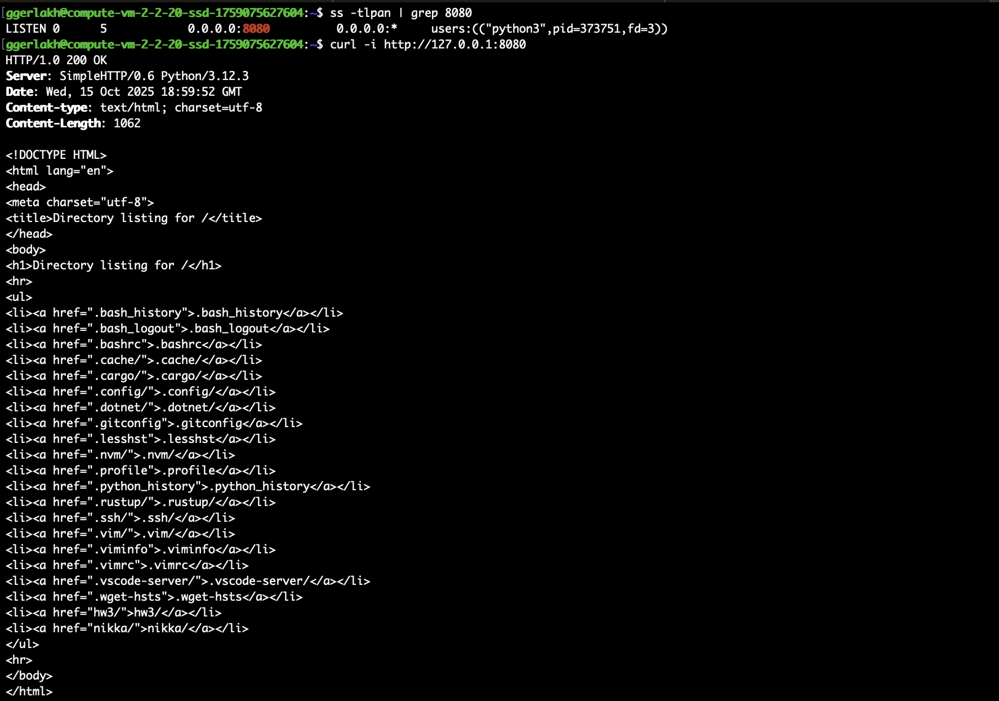
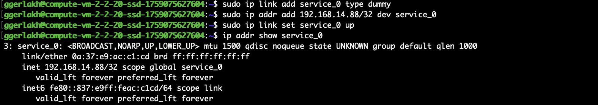
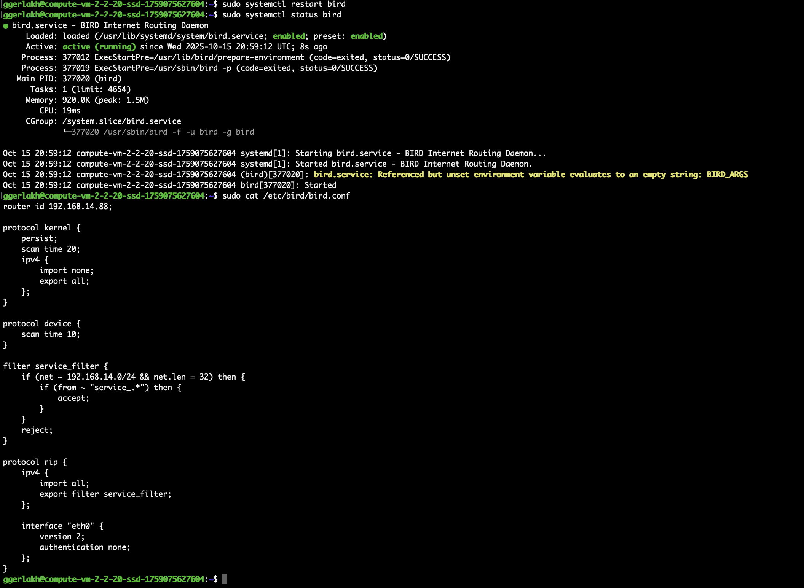
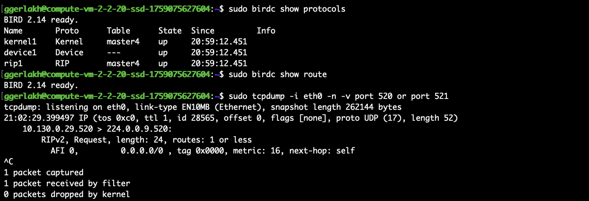
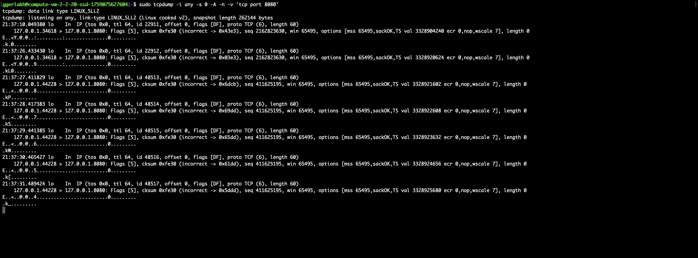

# ДЗ№3 (Сетевой стек)

## Задание 1. Анализ состояний TCP-соединений

* Запустил python сервер на порту 8080
  ```bash
  python3 -m http.server 8080
  ```
  
* Затем, проверил слушающие порты и при помощи команды 
  ```bash
  ss -tlpan | grep 8080
  ```
  , нашел сокет с запущеным python HTTP сервером  
  сделал HTTP запрос к нему через curl
  ```bash
  curl -i http://127.0.0.1:8080
  ```
  , и затем снова отфильтровал сокеты через команду `ss` и увидел сокет в состоянии `TIME_WAIT`
  
  Согласно заданным настрокам в операционной сиситеме Linux, после активного закрытия он находится в состоянии `TIME_WAIT` в течении `2*MSL` секунд для надежного завершения, где MSL - это заданный параметр в операционной сиситеме. Из-за этого, если сервис находиться под нагрузкой и соединения быстро расходуются, соединения не успевают освобождаться после активного закрытия.

## Задание 2. Динамическая маршрутизация с BIRD

* Настроил dummy-интерфейс с адресом 192.168.14.88/32 и именем service_0
  ```bash
  sudo ip link add service_0 type dummy
  sudo ip addr add 192.168.14.88/32 dev service_0
  sudo ip link set service_0 up
  ip addr show service_0
  ```
  
* При помощи конфигурации описанной в [bird.conf](./bird.conf), настроил анонсирование адреса `192.168.14.88/32`, а также любого адерса из подсети `192.168.14.0/24` с маской `/32` и именем которое начинается с `service_`
* Настроил остальные интерфейсы
  ```bash
  # service_1
  sudo ip link add service_1 type dummy
  sudo ip addr add 192.168.14.1/30 dev service_1
  sudo ip link set service_1 up

  # service_2
  sudo ip link add service_2 type dummy
  sudo ip addr add 192.168.10.4/32 dev service_2
  sudo ip link set service_2 up

  # srv_1
  sudo ip link add srv_1 type dummy
  sudo ip addr add 192.168.14.4/32 dev srv_1
  sudo ip link set srv_1 up
  ```
  
  И запустил bird
  
  Запустил команду tcpdump
  


## Задание 3. Настройка фаервола/ Host Firewalling

* Запустил python сервер на порту 8080
  ```bash
  python3 -m http.server 8080
  ```
  
* Затем проверил, что сервер работает через `curl` и создал правило через `iptables`:
  ```bash
  sudo iptables -A INPUT -p tcp --dport 8080 -j DROP
  ```
  
* Продемонстрировал работу firewall через `tcpdump`
  ```bash
  sudo tcpdump -i any -s 0 -A -n -v 'tcp port 8080'
  ```
  

## Задание 4. Аппаратное ускорение сетевого трафика

* При помощи команды `ethtool` выяснил, что на адаптере включен TCP segmentation offload
  ```bash
  sudo ethtool -k eth0
  ```
* TCP segmentation offload - это аппаратная технология, которая ускоряет обработку больших объемов данных за счет разбиения данных на сегменты MTU.